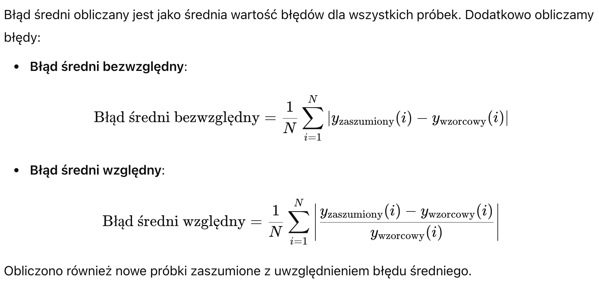
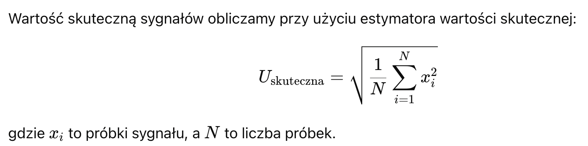
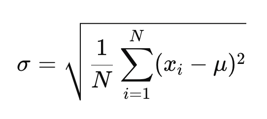

# Laboratorium
## Rozwiązania zadań:

Ten dokument zawiera rozwiązania zadań przy użyciu Pythona i biblioteki NumPy. Każde zadanie jest wyjaśnione w komentarzach i zilustrowane przykładowym kodem.

### 1. Tworzenie katalogu
Aby utworzyć katalog w Pythonie, użyj funkcji `os.mkdir()`.

```python
import os
os.mkdir("nazwa_katalogu")  # Tworzy katalog o nazwie "nazwa_katalogu"
```

### 2. Zmiana bieżącego katalogu
Aby zmienić bieżący katalog roboczy, użyj funkcji `os.chdir()`.

```python
import os
os.chdir("sciezka_do_katalogu")  # Zmienia bieżący katalog na "sciezka_do_katalogu"
```

### 3. Lista zawartości pustego katalogu
Funkcja `os.listdir()` zwraca zawartość katalogu. Jeśli katalog jest pusty, zwraca pustą listę.

```python
import os
print(os.listdir())  # Wynik: [] (pusta lista)
```

### 4. Zapisywanie i wczytywanie zmiennych
Aby zapisać zmienne do pliku i je ponownie wczytać, użyj `numpy.save()` i `numpy.load()`.

```python
import numpy as np

# Zapisywanie zmiennych
a = 10
b = 20
np.save("dane.npy", np.array([a, b]))  # Zapisuje zmienne do "dane.npy"

# Wczytywanie zmiennych
loaded_data = np.load("dane.npy")  # Wczytuje zmienne z "dane.npy"
print(loaded_data)  # Wynik: [10 20]
```

### 5. Czyszczenie zmiennych i konsoli
Aby usunąć zmienną z pamięci, użyj `del`.
Aby wyczyścić konsolę, użyj `os.system()`.

```python
a = 10
del a  # Usuwa zmienną 'a' z pamięci

import os
os.system('cls' if os.name == 'nt' else 'clear')  # Czyści konsolę
```

### 6. Wyświetlanie nazw zmiennych w pamięci
Aby wyświetlić wszystkie nazwy zmiennych w pamięci, użyj funkcji `globals()`.

```python
a = 10
b = 20
print([var for var in globals() if not var.startswith("__")])  # Wynik: ['a', 'b']
```

### 7. Określanie rozmiaru zmiennej
Aby określić rozmiar tablicy NumPy, użyj atrybutu `.shape`.

```python
import numpy as np
a = np.array([[1, 2, 3], [4, 5, 6]])
print(a.shape)  # Wynik: (2, 3)
```

### 8. Tworzenie macierzy 3x3
Aby utworzyć macierz 3x3, użyj funkcji `numpy.array()`.

```python
import numpy as np
a = np.array([[1, 2, 3], [4, 5, 6], [7, 8, 9]])
print(a)
```

### 9. Użycie operatora zakresu
Funkcja `numpy.arange()` generuje sekwencję liczb.

Z krokiem 1:

```python
import numpy as np
print(np.arange(1, 6))  # Wynik: [1 2 3 4 5]
```

Z krokiem 0.25:

```python
print(np.arange(0, 1.25, 0.25))  # Wynik: [0.   0.25 0.5  0.75 1.  ]
```

### 10. Dostęp do elementów macierzy
Możesz uzyskać dostęp do wierszy, kolumn lub poszczególnych elementów macierzy.

```python
import numpy as np
a = np.array([[1, 2, 3], [4, 5, 6], [7, 8, 9]])

# Pierwszy wiersz
print(a[0, :])  # Wynik: [1 2 3]

# Druga kolumna
print(a[:, 1])  # Wynik: [2 5 8]

# Element (2,3)
print(a[1, 2])  # Wynik: 6
```

### 11. Wyświetlanie elementów macierzy mniejszych niż wartość
Aby wyświetlić elementy macierzy mniejsze niż określona wartość, użyj indeksowania logicznego.

```python
print(a[a < 5])  # Wynik: [1 2 3 4]
```

### 12. Generowanie macierzy jednostkowej 5x5
Użyj `numpy.eye()`.

```python
import numpy as np
print(np.eye(5))  # Wynik: macierz jednostkowa 5x5
```

### 13. Generowanie macierzy zerowej 3x3
Użyj `numpy.zeros()`, aby utworzyć macierz zerową.

```python
print(np.zeros((3, 3)))  # Wynik: macierz zerowa 3x3
```

### 14. Generowanie macierzy jedynek 3x3
Użyj ```numpy.ones()```, aby utworzyć macierz wypełnioną jedynkami.

```python
print(np.ones((3, 3)))  # Wynik: macierz 3x3 wypełniona jedynkami
```

### 15. Generowanie macierzy diagonalnej 3x3
Użyj ```numpy.diag()```, aby utworzyć macierz diagonalną.

```python
print(np.diag([1, 2, 3]))  # Wynik: macierz diagonalna 3x3 z wartościami [1, 2, 3]
```

### 16. Generowanie losowej macierzy 3x3
Użyj ```numpy.random.rand()```, aby utworzyć macierz z losowymi wartościami.

```python
print(np.random.rand(3, 3))  # Wynik: macierz 3x3 z losowymi wartościami między 0 a 1
```

### 17. Pobieranie głównej przekątnej macierzy
Użyj ```numpy.diag()```, aby pobrać główną przekątną macierzy.

```python
a = np.random.rand(3, 3)
print(np.diag(a))  # Wynik: główna przekątna macierzy 'a'
```

### 18. Łączenie macierzy
Aby połączyć dwie macierze 2x2 poziomo, użyj ```numpy.hstack()```.

```python
a = np.array([[1, 2], [3, 4]])
b = np.array([[5, 6], [7, 8]])
c = np.hstack((a, b))  # Poziome łączenie macierzy
print(c)
```

### 19. Macierze trójkątne górne i dolne
Użyj ```numpy.triu()```, aby uzyskać górną część macierzy trójkątnej.
Użyj ```numpy.tril()```, aby uzyskać dolną część macierzy trójkątnej.

```python
print(np.triu(a))  # Górna część macierzy trójkątnej
print(np.tril(a))  # Dolna część macierzy trójkątnej
```

### 20. Transponowanie macierzy
Użyj atrybutu ```.T```, aby transponować macierz.

```python
a = np.array([[1, 2, 3], [4, 5, 6], [7, 8, 9]])
b = a.T  # Transponowanie macierzy
print(b)
```

# LAB 2
## 1. Tworzenie kopii macierzy `a`
```python
import numpy as np

a = np.array([[1, 2, 3], [4, 5, 6], [7, 8, 9]])
b = a.copy()  # Tworzenie kopii macierzy
print(b)
```

## 2. Zmiana rozmiaru macierzy `a` na (2x2) bez utraty danych
```python
a_resized = a[:2, :2]  # Wycinanie części macierzy
print(a_resized)
```

## 3. Powiększenie macierzy `a` o dwa wiersze zer
```python
a_expanded = np.vstack((a, np.zeros((2, 3))))
print(a_expanded)
```

## 4. Definicja pustej macierzy
```python
a_empty = np.empty((0, 0))
print(a_empty)
```

## 5. Tworzenie pustej macierzy i dodawanie do niej wierszy
```python
a = np.empty((0, 3))
a = np.vstack([a, [1, 2, 3]])
a = np.vstack([a, [4, 5, 6]])
a = np.vstack([a, [7, 8, 9]])
print(a)
```

## 6. Indeksowanie elementów macierzy
```python
print(a[1, 1])  # Indeksowanie standardowe
print(a[1][1])  # Alternatywny sposób indeksowania
```

## 7. Zmiana rozmiaru macierzy `a` na (2x6) przy użyciu `reshape`
```python
a_reshaped = a.reshape(2, 6)
print(a_reshaped)
```

## 8. Przywrócenie macierzy `a` do oryginalnego rozmiaru (3x3)
```python
a_restored = a.reshape(3, 3)
print(a_restored)
```

## 9. Wyświetlanie macierzy w postaci kolumnowej
```python
print(a.flatten(order='F'))
```

## 10. Tworzenie magicznego kwadratu i sprawdzanie sum
```python
a = np.array([[8, 1, 6], [3, 5, 7], [4, 9, 2]])
print(np.sum(a, axis=0))  # Suma kolumn
print(np.sum(a, axis=1))  # Suma wierszy
```

## 11. Generowanie macierzy Hilberta dla `n=4`
```python
from scipy.linalg import hilbert

h = hilbert(4)
print(h)
```

## 12. Podstawowe operacje na macierzach
```python
a = np.array([[1, 2], [3, 4]])
b = np.array([[1, -1], [-1, 1]])

print(a + b)  # Dodawanie
print(a - b)  # Odejmowanie
print(a * b)  # Mnożenie element po elemencie
print(a / 2)  # Dzielenie przez skalar
```

## 13. Dzielenie macierzowe (lewostronne i prawostronne)
```python
a = np.array([[1, 2, 3]])
b = np.array([[6, 5, 4]])

x_left = np.linalg.lstsq(a.T, b.T, rcond=None)[0]  # Lewostronne
x_right = np.linalg.lstsq(b, a, rcond=None)[0]  # Prawostronne
print(x_left, x_right)
```

## 14. Rozwiązywanie układu równań liniowych
```python
A = np.array([[2, -2, 1], [1, 4, -2], [6, -1, -1]])
b = np.array([-4, 1, 2])
x = np.linalg.solve(A, b)
print(x)
```

## 15. Rozwiązywanie równań kwadratowych
```python
import sympy as sp

a, b, c = sp.symbols('a b c')
x = sp.symbols('x')
quadratic_eq = sp.Eq(a*x**2 + b*x + c, 0)
solutions = sp.solve(quadratic_eq, x)
print(solutions)
```

## 16. Rozwiązywanie układu równań z macierzą 4x4
```python
import math

# Input coefficients
a = float(input("Enter coefficient a: "))
b = float(input("Enter coefficient b: "))
c = float(input("Enter coefficient c: "))

# Calculating discriminant
D = b**2 - 4*a*c

if D > 0:
    x1 = (-b + math.sqrt(D)) / (2*a)
    x2 = (-b - math.sqrt(D)) / (2*a)
    print(f"Two real solutions: x1 = {x1}, x2 = {x2}")
elif D == 0:
    x = -b / (2*a)
    print(f"One real solution: x = {x}")
else:
    real_part = -b / (2*a)
    imaginary_part = math.sqrt(-D) / (2*a)
    print(f"Complex solutions: x1 = {real_part} + {imaginary_part}i, x2 = {real_part} - {imaginary_part}i")
```

### 17.
```python
import numpy as np

# Coefficient matrix A
A = np.array([[1, 1, 1, 1],
              [3, 2, 4, 5],
              [2, 1, -1, -2],
              [4, 3, 2, 1]])

# Constants vector B
B = np.array([2, -1, -1, 1])

# Calculating the determinant of A
det_A = np.linalg.det(A)

if det_A != 0:
    # Cramer's Rule to solve for x, y, z, a
    X = np.linalg.inv(A).dot(B)
    print(f"Solution: x = {X[0]}, y = {X[1]}, z = {X[2]}, a = {X[3]}")
else:
    print("No unique solution exists (determinant is zero).")
```

### 18.
```python
import numpy as np

# Input coefficients
a = float(input("Enter coefficient a: "))
b = float(input("Enter coefficient b: "))
c = float(input("Enter coefficient c: "))
d = float(input("Enter coefficient d: "))

# Defining the cubic equation
coefficients = [a, b, c, d]

# Finding the roots using numpy's roots function
roots = np.roots(coefficients)

# Printing the roots
print("The roots of the cubic equation are:")
for root in roots:
    print(root)
```

# Laboratorium 3: Analiza sygnałów zaszumionych

## Wprowadzenie

W ćwiczeniu opracowany został program, który na podstawie plików wejściowych:
1. **arguments of sine.txt** - sygnał wejściowy wymuszenia
2. **sine.txt** - odpowiedź w formie funkcji sinusoidalnej
3. **sine with noise.txt** - zaszumiony sygnał wyjściowy

Program analizuje sygnał wzorcowy oraz zaszumiony, obliczając błędy, wartość skuteczną, odchylenie standardowe oraz błędy średnie.

## Zadania

### Zadanie 1 - Określenie błędów dla poszczególnych próbek sygnału

Błąd dla każdej próbki sygnału obliczany jest jako różnica między wartością zaszumionego sygnału a wartością sygnału wzorcowego:

\[
\text{Błąd}_i = y_{\text{zaszumiony}}(i) - y_{\text{wzorcowy}}(i)
\]

W celu obliczenia błędów dla poszczególnych próbek sygnału wczytano dane z plików **sine.txt** i **sine with noise.txt**, a następnie obliczono różnice.

```python
import numpy as np

# Wczytanie danych z plików
sine_values = np.loadtxt('sine.txt')
noise_values = np.loadtxt('sine with noise.txt')

# Obliczanie błędu dla każdej próbki
errors = noise_values - sine_values

# Wyświetlenie wyników
print("Błędy dla poszczególnych próbek sygnału:")
print(errors)
```

### Zadanie 2 - Określ jaki jest błąd średni (względny, bezwzględny dla sygnału zaszumionego i wzorcowego) oraz jak on wpływa na kształt zaszumionego sygnału (obliczyć nowe wartości próbek zaszumionych z uwzględnieniem błędu średniego).



```python

# Obliczanie błędu średniego bezwzględnego
mean_absolute_error = np.mean(np.abs(errors))

# Obliczanie błędu średniego względnego
mean_relative_error = np.mean(np.abs(errors / sine_values))

print(f"Błąd średni bezwzględny: {mean_absolute_error}")
print(f"Błąd średni względny: {mean_relative_error}")

# Obliczanie nowych próbek zaszumionych uwzględniając błąd średni
corrected_noise_values = noise_values - mean_absolute_error
print("Skorygowane wartości próbek zaszumionych:")
print(corrected_noise_values)
```

### 3. Określenie wartości skutecznej sygnałów



```python

# Obliczanie wartości skutecznej dla sygnałów
effective_value_sine = np.sqrt(np.mean(sine_values**2))
effective_value_noise = np.sqrt(np.mean(noise_values**2))

print(f"Wartość skuteczna sygnału sine.txt: {effective_value_sine}")
print(f"Wartość skuteczna sygnału sine with noise.txt: {effective_value_noise}")
```

### 4. Określ jakie jest odchylenie standardowe dla zaszumionego sygnału, porównaj z sygnałem, w którym wprowadzono korektę w postaci błędu średniego.




```python
# Obliczanie odchylenia standardowego dla zaszumionego sygnału
std_noise = np.std(noise_values)

# Obliczanie odchylenia standardowego dla skorygowanego sygnału
std_corrected_noise = np.std(corrected_noise_values)

print(f"Odchylenie standardowe dla zaszumionego sygnału: {std_noise}")
print(f"Odchylenie standardowe dla skorygowanego sygnału: {std_corrected_noise}")
```

### 5. Rozkład błędów wokół wartości średniej Rozkład błędów wokół średniej możemy zwizualizować przy pomocy histogramu. Histogram przedstawia rozkład błędów w obrębie wartości średniej.

```python
import matplotlib.pyplot as plt

# Rysowanie histogramu błędów
plt.hist(errors, bins=30, edgecolor='black')
plt.title('Rozkład błędów wokół wartości średniej')
plt.xlabel('Błąd')
plt.ylabel('Liczba próbek')
plt.show()
```

### 6. Określ ile wynosi błąd średniej arytmetycznej
```python
# Obliczanie błędu średniej arytmetycznej
mean_noise = np.mean(noise_values)
mean_sine = np.mean(sine_values)

mean_error = mean_noise - mean_sine
print(f"Błąd średniej arytmetycznej: {mean_error}")
```

