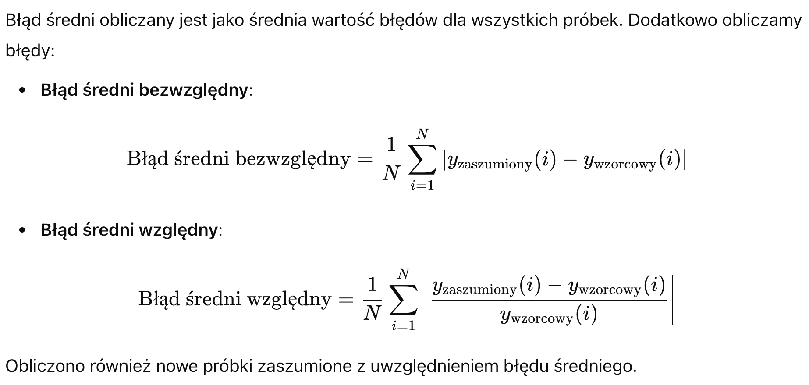
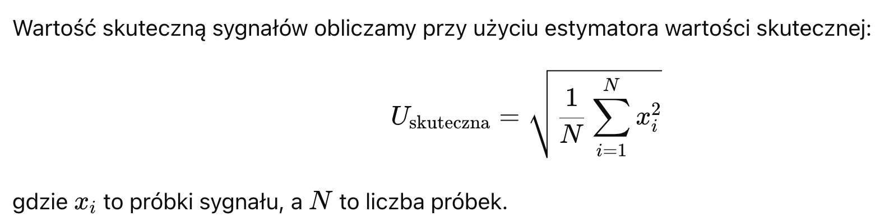
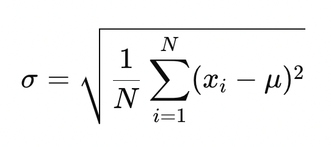

# Laboratorium MNiS
## Laboratorium 1 - Wprowadzenie w języku Python

Ten dokument zawiera rozwiązania zadań przy użyciu Pythona i biblioteki NumPy. Każde zadanie jest wyjaśnione w komentarzach i zilustrowane przykładowym kodem.

[Link z opisem biblioteki NumPy](https://cs231n.github.io/python-numpy-tutorial/)

### 1. Tworzenie katalogu
Aby utworzyć katalog w Pythonie, użyj funkcji os.mkdir(). Możesz również sprawdzić, czy katalog już istnieje, aby uniknąć błędów.

```python
import os

# Tworzenie katalogu
def create_directory(directory_name):
    if not os.path.exists(directory_name):  # Sprawdza, czy katalog już istnieje
        os.mkdir(directory_name)
        print(f"Katalog '{directory_name}' został utworzony.")
    else:
        print(f"Katalog '{directory_name}' już istnieje.")

create_directory("nazwa_katalogu")  # Tworzy katalog o nazwie "nazwa_katalogu"
```

### 2. Zmiana bieżącego katalogu
Aby zmienić bieżący katalog roboczy, użyj funkcji os.chdir(). Pamiętaj, że zmiana katalogu roboczego wpływa na wszystkie operacje wykonywane w skrypcie po jej zastosowaniu.
```python
import os

# Zmiana bieżącego katalogu
def change_directory(path):
    try:
        os.chdir(path)  # Zmienia bieżący katalog na "path"
        print(f"Zmieniono katalog roboczy na: {os.getcwd()}")  # Wyświetla aktualny katalog roboczy
    except FileNotFoundError:
        print(f"Ścieżka {path} nie istnieje.")

change_directory("/path/to/directory")  # Przykład zmiany katalogu roboczego

```

### 3. Lista zawartości pustego katalogu
Funkcja `os.listdir()` zwraca zawartość katalogu. Jeśli katalog jest pusty, zwraca pustą listę.

```python
import os

print(os.listdir())  # Wynik: [] (pusta lista)
```

### 4. Zapisywanie i wczytywanie zmiennych
Aby zapisać zmienne do pliku i je ponownie wczytać, użyj `numpy.save()` i `numpy.load()`. 

```python
import numpy as np

# Zapisywanie zmiennych
a = 10
b = 20
np.save("dane.npy", np.array([a, b]))  # Zapisuje zmienne do "dane.npy"

# Wczytywanie zmiennych
loaded_data = np.load("dane.npy")  # Wczytuje zmienne z "dane.npy"
print(loaded_data)  # Wynik: [10 20]
```

### 5. Czyszczenie zmiennych i konsoli
Aby usunąć zmienną z pamięci, użyj `del`.
Aby wyczyścić konsolę, użyj `os.system()`.

```python
# Usuwanie zmiennej z pamięci
x = 42
print(f"Przed usunięciem: x = {x}")
del x  # Usuwa zmienną 'x' z pamięci

try:
    print(x)  # Próba dostępu do usuniętej zmiennej spowoduje błąd
except NameError:
    print("Zmienna 'x' została usunięta z pamięci.")

# Czyszczenie konsoli
import os

# Funkcja do czyszczenia konsoli
def clear_console():
    os.system('cls' if os.name == 'nt' else 'clear')

print("Konsola zostanie wyczyszczona...")
clear_console()
```

### 6. Wyświetlanie nazw zmiennych w pamięci
Aby wyświetlić wszystkie nazwy zmiennych w pamięci, użyj funkcji `globals()`.

```python
# Definiowanie zmiennych
x = 5
y = 15
z = 25

# Wyświetlanie nazw zmiennych globalnych
print([var for var in globals() if var in ['x', 'y', 'z']])  
```

### 7. Określanie rozmiaru zmiennej
Aby określić rozmiar tablicy NumPy, użyj atrybutu `.shape`.

```python
import numpy as np
# Tworzenie tablicy NumPy
a = np.array([[1, 2, 3], [4, 5, 6]])
print(a.shape)  # Wynik: (2, 3)
```

### 8. Tworzenie macierzy 3x3
Aby utworzyć macierz 3x3, użyj funkcji `numpy.array()`.

```python
import numpy as np
a = np.array([[1, 2, 3], [4, 5, 6], [7, 8, 9]])
print(a)
```

### 9. Użycie operatora zakresu
Funkcja `numpy.arange()` generuje sekwencję liczb.

Z krokiem 1:

```python
import numpy as np
print(np.arange(1, 6))  # Wynik: [1 2 3 4 5]
```

Z krokiem 0.25:

```python
print(np.arange(0, 1.25, 0.25))  # Wynik: [0.   0.25 0.5  0.75 1.  ]
```

### 10. Dostęp do elementów macierzy
Możesz uzyskać dostęp do wierszy, kolumn lub poszczególnych elementów macierzy.

```python
import numpy as np
a = np.array([[1, 2, 3], [4, 5, 6], [7, 8, 9]])

# Pierwszy wiersz
print(a[0, :])  # Wynik: [1 2 3]

# Druga kolumna
print(a[:, 1])  # Wynik: [2 5 8]

# Element (2,3)
print(a[1, 2])  # Wynik: 6
```

### 11. Wyświetlanie elementów macierzy mniejszych niż wartość
Aby wyświetlić elementy macierzy mniejsze niż określona wartość, użyj indeksowania logicznego.

```python
print(a[a < 5])  # Wynik: [1 2 3 4]
```

### 12. Generowanie macierzy jednostkowej 5x5
Użyj `numpy.eye()`.

```python
import numpy as np
print(np.eye(5))  # Wynik: macierz jednostkowa 5x5
```

### 13. Generowanie macierzy zerowej 3x3
Użyj `numpy.zeros()`, aby utworzyć macierz zerową.

```python
print(np.zeros((3, 3)))  # Wynik: macierz zerowa 3x3
```

### 14. Generowanie macierzy jedynek 3x3
Użyj ```numpy.ones()```, aby utworzyć macierz wypełnioną jedynkami.

```python
print(np.ones((3, 3)))  # Wynik: macierz 3x3 wypełniona jedynkami
```

### 15. Generowanie macierzy diagonalnej 3x3
Użyj ```numpy.diag()```, aby utworzyć macierz diagonalną.

```python
print(np.diag([1, 2, 3]))  # Wynik: macierz diagonalna 3x3 z wartościami [1, 2, 3]
```

### 16. Generowanie losowej macierzy 3x3
Użyj ```numpy.random.rand()```, aby utworzyć macierz z losowymi wartościami.

```python
print(np.random.rand(3, 3))  # Wynik: macierz 3x3 z losowymi wartościami między 0 a 1
```

### 17. Pobieranie głównej przekątnej macierzy
Użyj ```numpy.diag()```, aby pobrać główną przekątną macierzy.

```python
a = np.random.rand(3, 3)
print(np.diag(a))  # Wynik: główna przekątna macierzy 'a'
```

### 18. Łączenie macierzy
Aby połączyć dwie macierze 2x2 poziomo, użyj ```numpy.hstack()```.

```python
a = np.array([[1, 2], [3, 4]])
b = np.array([[5, 6], [7, 8]])
c = np.hstack((a, b))  # Poziome łączenie macierzy
print(c)
```

### 19. Macierze trójkątne górne i dolne
Użyj ```numpy.triu()```, aby uzyskać górną część macierzy trójkątnej.
Użyj ```numpy.tril()```, aby uzyskać dolną część macierzy trójkątnej.

```python
print(np.triu(a))  # Górna część macierzy trójkątnej
print(np.tril(a))  # Dolna część macierzy trójkątnej
```

### 20. Transponowanie macierzy
Użyj atrybutu ```.T```, aby transponować macierz.

```python
a = np.array([[1, 2, 3], [4, 5, 6], [7, 8, 9]])
b = a.T  # Transponowanie macierzy
print(b)
```

# Laboratorium 2 - Układy równań
## 1. Tworzenie kopii macierzy `a`
```python
import numpy as np

a = np.array([[1, 2, 3], [4, 5, 6], [7, 8, 9]])
b = a.copy()  # Tworzenie kopii macierzy
print(b)
```

## 2. Zmiana rozmiaru macierzy `a` na (2x2) bez utraty danych
```python
a_resized = a[:2, :2]  # Wycinanie części macierzy
print(a_resized)
```

## 3. Powiększenie macierzy `a` o dwa wiersze zer
```python
a_expanded = np.vstack((a, np.zeros((2, 3))))
print(a_expanded)
```

## 4. Definicja pustej macierzy
```python
a_empty = np.empty((0, 0))
print(a_empty)
```

## 5. Tworzenie pustej macierzy i dodawanie do niej wierszy
```python
a = np.empty((0, 3))
a = np.vstack([a, [1, 2, 3]])
a = np.vstack([a, [4, 5, 6]])
a = np.vstack([a, [7, 8, 9]])
print(a)
```

## 6. Indeksowanie elementów macierzy
```python
print(a[1, 1])  # Indeksowanie standardowe
print(a[1][1])  # Alternatywny sposób indeksowania
```

## 7. Zmiana rozmiaru macierzy `a` na (2x6) przy użyciu `reshape`
```python
a_reshaped = a.reshape(2, 6)
print(a_reshaped)
```

## 8. Przywrócenie macierzy `a` do oryginalnego rozmiaru (3x3)
```python
a_restored = a.reshape(3, 3)
print(a_restored)
```

## 9. Wyświetlanie macierzy w postaci kolumnowej
```python
print(a.flatten(order='F'))
```

## 10. Tworzenie magicznego kwadratu i sprawdzanie sum
```python
a = np.array([[8, 1, 6], [3, 5, 7], [4, 9, 2]])
print(np.sum(a, axis=0))  # Suma kolumn
print(np.sum(a, axis=1))  # Suma wierszy
```

## 11. Generowanie macierzy Hilberta dla `n=4`
```python
from scipy.linalg import hilbert

h = hilbert(4)
print(h)
```

## 12. Podstawowe operacje na macierzach
```python
a = np.array([[1, 2], [3, 4]])
b = np.array([[1, -1], [-1, 1]])

print(a + b)  # Dodawanie
print(a - b)  # Odejmowanie
print(a * b)  # Mnożenie element po elemencie
print(a / 2)  # Dzielenie przez skalar
```

## 13. Dzielenie macierzowe (lewostronne i prawostronne)
```python
a = np.array([[1, 2, 3]])
b = np.array([[6, 5, 4]])

x_left = np.linalg.lstsq(a.T, b.T, rcond=None)[0]  # Lewostronne
x_right = np.linalg.lstsq(b, a, rcond=None)[0]  # Prawostronne
print(x_left, x_right)
```

## 14. Rozwiązywanie układu równań liniowych
```python
A = np.array([[2, -2, 1], [1, 4, -2], [6, -1, -1]])
b = np.array([-4, 1, 2])
x = np.linalg.solve(A, b)
print(x)
```

## 15. Rozwiązywanie równań kwadratowych
```python
import sympy as sp

a, b, c = sp.symbols('a b c')
x = sp.symbols('x')
quadratic_eq = sp.Eq(a*x**2 + b*x + c, 0)
solutions = sp.solve(quadratic_eq, x)
print(solutions)
```

## 16. Rozwiązywanie układu równań z macierzą 4x4
```python
import math

# Input coefficients
a = float(input("Enter coefficient a: "))
b = float(input("Enter coefficient b: "))
c = float(input("Enter coefficient c: "))

# Calculating discriminant
D = b**2 - 4*a*c

if D > 0:
    x1 = (-b + math.sqrt(D)) / (2*a)
    x2 = (-b - math.sqrt(D)) / (2*a)
    print(f"Two real solutions: x1 = {x1}, x2 = {x2}")
elif D == 0:
    x = -b / (2*a)
    print(f"One real solution: x = {x}")
else:
    real_part = -b / (2*a)
    imaginary_part = math.sqrt(-D) / (2*a)
    print(f"Complex solutions: x1 = {real_part} + {imaginary_part}i, x2 = {real_part} - {imaginary_part}i")
```

### 17. Rozwiązywanie układu równań liniowych za pomocą reguły Cramera
```python
import numpy as np

# Coefficient matrix A
A = np.array([[1, 1, 1, 1],
              [3, 2, 4, 5],
              [2, 1, -1, -2],
              [4, 3, 2, 1]])

# Constants vector B
B = np.array([2, -1, -1, 1])

# Calculating the determinant of A
det_A = np.linalg.det(A)

if det_A != 0:
    # Cramer's Rule to solve for x, y, z, a
    X = np.linalg.inv(A).dot(B)
    print(f"Solution: x = {X[0]}, y = {X[1]}, z = {X[2]}, a = {X[3]}")
else:
    print("No unique solution exists (determinant is zero).")
```

### 18. Rozwiązywanie równań sześciennych za pomocą funkcji **numpy.roots**
```python
import numpy as np

# Input coefficients
a = float(input("Enter coefficient a: "))
b = float(input("Enter coefficient b: "))
c = float(input("Enter coefficient c: "))
d = float(input("Enter coefficient d: "))

# Defining the cubic equation
coefficients = [a, b, c, d]

# Finding the roots using numpy's roots function
roots = np.roots(coefficients)

# Printing the roots
print("The roots of the cubic equation are:")
for root in roots:
    print(root)
```

# Laboratorium 3 - Analiza sygnałów zaszumionych

## Wprowadzenie

W ćwiczeniu opracowany został program, który na podstawie plików wejściowych:
1. **arguments of sine.txt** - sygnał wejściowy wymuszenia
2. **sine.txt** - odpowiedź w formie funkcji sinusoidalnej
3. **sine with noise.txt** - zaszumiony sygnał wyjściowy

Program analizuje sygnał wzorcowy oraz zaszumiony, obliczając błędy, wartość skuteczną, odchylenie standardowe oraz błędy średnie.


### 1. Określenie błędów dla poszczególnych próbek sygnału

Błąd dla każdej próbki sygnału obliczany jest jako różnica między wartością zaszumionego sygnału a wartością sygnału wzorcowego:

\[
\text{Błąd}_i = y_{\text{zaszumiony}}(i) - y_{\text{wzorcowy}}(i)
\]

W celu obliczenia błędów dla poszczególnych próbek sygnału wczytano dane z plików **sine.txt** i **sine with noise.txt**, a następnie obliczono różnice.

```python
import numpy as np

# Wczytanie danych z plików
sine_values = np.loadtxt('sine.txt')
noise_values = np.loadtxt('sine with noise.txt')

# Obliczanie błędu dla każdej próbki
errors = noise_values - sine_values

# Wyświetlenie wyników
print("Błędy dla poszczególnych próbek sygnału:")
print(errors)
```

### 2. Określ jaki jest błąd średni (względny, bezwzględny dla sygnału zaszumionego i wzorcowego) oraz jak on wpływa na kształt zaszumionego sygnału (obliczyć nowe wartości próbek zaszumionych z uwzględnieniem błędu średniego).



```python

# Obliczanie błędu średniego bezwzględnego
mean_absolute_error = np.mean(np.abs(errors))

# Obliczanie błędu średniego względnego
mean_relative_error = np.mean(np.abs(errors / sine_values))

print(f"Błąd średni bezwzględny: {mean_absolute_error}")
print(f"Błąd średni względny: {mean_relative_error}")

# Obliczanie nowych próbek zaszumionych uwzględniając błąd średni
corrected_noise_values = noise_values - mean_absolute_error
print("Skorygowane wartości próbek zaszumionych:")
print(corrected_noise_values)
```

### 3. Określenie wartości skutecznej sygnałów



```python

# Obliczanie wartości skutecznej dla sygnałów
effective_value_sine = np.sqrt(np.mean(sine_values**2))
effective_value_noise = np.sqrt(np.mean(noise_values**2))

print(f"Wartość skuteczna sygnału sine.txt: {effective_value_sine}")
print(f"Wartość skuteczna sygnału sine with noise.txt: {effective_value_noise}")
```

### 4. Określ jakie jest odchylenie standardowe dla zaszumionego sygnału, porównaj z sygnałem, w którym wprowadzono korektę w postaci błędu średniego.




```python
# Obliczanie odchylenia standardowego dla zaszumionego sygnału
std_noise = np.std(noise_values)

# Obliczanie odchylenia standardowego dla skorygowanego sygnału
std_corrected_noise = np.std(corrected_noise_values)

print(f"Odchylenie standardowe dla zaszumionego sygnału: {std_noise}")
print(f"Odchylenie standardowe dla skorygowanego sygnału: {std_corrected_noise}")
```

### 5. Rozkład błędów wokół wartości średniej Rozkład błędów wokół średniej możemy zwizualizować przy pomocy histogramu. Histogram przedstawia rozkład błędów w obrębie wartości średniej.

```python
import matplotlib.pyplot as plt

# Rysowanie histogramu błędów
plt.hist(errors, bins=30, edgecolor='black')
plt.title('Rozkład błędów wokół wartości średniej')
plt.xlabel('Błąd')
plt.ylabel('Liczba próbek')
plt.grid(True)
plt.show()
```

### 6. Określ ile wynosi błąd średniej arytmetycznej
```python
# Obliczanie błędu średniej arytmetycznej
mean_noise = np.mean(noise_values)
mean_sine = np.mean(sine_values)

mean_error = mean_noise - mean_sine
print(f"Błąd średniej arytmetycznej: {mean_error}")
```

# Laboratorium 4 - Rozwiązywanie równań nieliniowych


## 3.1 Metoda Bisekcji

## Przykład: Pierwiastek Trzeciego Stopnia

Problem obliczenia pierwiastka trzeciego stopnia z liczby \( a \) można sprowadzić do znalezienia pierwiastka równania:

$$ f(x) = x^3 - a $$

### Implementacja funkcji w Pythonie:

```python
import numpy as np
import matplotlib.pyplot as plt

# Funkcja definiująca równanie
def zadanie(x, z):
    return x**3 - z

# Funkcja do podziału przedziałów
def szukanie(gr_l, gr_p):
    return gr_l + (gr_p - gr_l) / 2

# Inicjalizacja
gr_l = -2
gr_p = 2
z = 3  # Szukamy pierwiastka z 3
delta = 10**-5
t = np.linspace(gr_l, gr_p, 1000)

# Metoda bisekcji
n = 1
tn = [n - 1]
x = [gr_p]
gr_c = gr_p

while abs(zadanie(gr_c, z)) > delta and abs(gr_p - gr_l) > delta:
    n += 1
    tn.append(n - 1)
    gr_c = szukanie(gr_l, gr_p)
    yc = zadanie(gr_c, z)
    ya = zadanie(gr_l, z)
    zero = ya * yc
    
    if zero < 0:
        gr_p = gr_c
    else:
        gr_l = gr_c

    x.append(gr_c)

# Wykres iteracji
plt.subplot(121)
plt.plot(t, zadanie(t, z))
plt.axhline(0, color='black',linewidth=1)
plt.axvline(0, color='black',linewidth=1)
plt.title('Wykres funkcji')

plt.subplot(122)
plt.plot(tn, x)
plt.title('Zbieżność metody bisekcji')

plt.show()
```

### 1. Zaimplementowanie algorytmu obliczania miejsc zerowych dla funkcji:
$$ \ f(x) = x^2 - 2 \ $$ 
### w przedziale [0, 3].

```python
import numpy as np

def f(x):
    """Funkcja, dla której szukamy pierwiastka: f(x) = x^2 - 2"""
    return x**2 - 2

def bisection_method(f, a, b, delta):
    """
    Implementacja metody bisekcji do znalezienia pierwiastka funkcji f w przedziale [a, b].
    """
    iterations = []
    while abs(b - a) > delta:
        c = (a + b) / 2
        iterations.append([a, b, c])
        if f(c) == 0:
            return c, np.array(iterations)  
        elif f(a) * f(c) < 0:
            b = c  
        else:
            a = c  
    return (a + b) / 2, np.array(iterations)

# Definicja parametrów
a, b, delta = 0, 3, 1e-5
root, iterations = bisection_method(f, a, b, delta)
print(f"Pierwiastek: {root}")

# Tabela zostanie wygenerowana za pomocą numpy.array, która zawiera iteracyjne wartości 
print("Tabela iteracji:")
print(iterations)
```

### 2. Przedstaw w postaci tabeli kolejne kroki przybliżeń jakie zostały otrzymane.

```python
import pandas as pd

pd.DataFrame(iterations, columns=["a", "b", "c"])
```

### 3. Testowanie algorytmu dla różnych wartości dokładności (delta)

```python
# Możemy zmieniać wartość delta i obserwować wpływ na liczbę iteracji:
# Testowanie dla różnych wartości delta

deltas = [1e-1, 1e-2, 1e-3, 1e-4, 1e-5]
for delta in deltas:
    root, iterations = bisection_method(f, a, b, delta)
    print(f"Pierwiastek dla delta={delta}: {root}, Liczba iteracji: {iterations.shape[0]}")
```

### 4. Jak zmienia się liczba iteracji w zależności od delta
Liczba iteracji będzie maleć w miarę zmniejszania się wartości delta, ponieważ dokładność rozwiązania będzie coraz wyższa.

### 5. Modyfikacja skryptu do wyznaczania miejsc zerowych w przedziale [-3, 3]
Aby znaleźć pierwiastki w przedziale [-3, 3], wystarczy zmienić przedziały na:

```python
a, b = -3, 3
root, iterations = bisection_method(f, a, b, delta)
```

## 3.2 Metoda Newtona

### 1. Implementacja algorytmu obliczania pierwiastka trzeciego stopnia

```python
def f_cubic(x, a):
    """Funkcja, dla której szukamy pierwiastka trzeciego stopnia: f(x) = x^3 - a"""
    return x**3 - a

def f_cubic_derivative(x):
    """Pochodna funkcji f_cubic(x, a) względem x"""
    return 3 * x**2

def newton_method(f, f_prime, x0, delta, max_iter=1000):
    """Metoda Newtona do znalezienia pierwiastka funkcji f."""
    iterations = []
    x = x0
    for i in range(max_iter):
        x_new = x - f(x) / f_prime(x)
        iterations.append([i, x, x_new])
        if abs(x_new - x) < delta:
            return x_new, np.array(iterations)
        x = x_new
    return x, np.array(iterations)
```

### 2. Wybór metody określania dokładności obliczeń
Użyjemy warunku zakończenia: 

```python
import numpy as np
import matplotlib.pyplot as plt

        # Warunek końcowy: sprawdzamy, czy wartość funkcji jest wystarczająco bliska zeru
        if abs(fx) <= epsilon:
            break  # Zakończenie obliczeń, gdy funkcja jest bliska zeru
        
        x = x_new  # Przechodzimy do nowego przybliżenia
    
    return x_values

# Wybór liczby podpierwiastkowej (np. pierwiastek trzeciego stopnia z 27)
a = 27
epsilon = 1e-6
max_iter = 100

# Punkt startowy (możesz dowolnie zmienić)
x0 = 5

# Obliczanie przybliżeń
x_values = newton_cubic_root(a, epsilon, max_iter, x0)
```

### 3. Modyfikacja programu dla różnych punktów startowych
Aby zrealizować ten punkt, generujemy różne wartości początkowe 

```python
import matplotlib.pyplot as plt

chosen_number = 27
random_x0s = np.random.randint(1, chosen_number, 4)
plt.figure(figsize=(10, 6))
for x0 in random_x0s:
    _, iterations = newton_method(lambda x: f_cubic(x, chosen_number), f_cubic_derivative, x0, 1e-5)
    iterations = np.array(iterations)
    plt.plot(iterations[:, 0], iterations[:, 2], label=f"x0 = {x0}")

plt.xlabel("Iteracja")
plt.ylabel("xk")
plt.legend()
plt.title(f"Dążenie algorytmu Newtona do wyniku dla liczby {chosen_number}")
plt.show()
```

### 4. Wylosuj **cztery różne punkty startowe** i wykreśl wykres przedstawiający **zbieżność metody Newtona** do rozwiązania równania nieliniowego dla funkcji:  
$$
f(x) = x^3 - a
$$

Zależność, którą należy przedstawić na wykresie, ma postać:

$$
x_k = f(\text{iteracja})
$$

Gdzie:

$x_k$ — wartość przybliżona w $k$-tej iteracji algorytmu,

$\text{iteracja}$ — numer kroku iteracyjnego.

```python
import numpy as np
import matplotlib.pyplot as plt

# Funkcja obliczająca pierwiastek trzeciego stopnia
def newton_cubic_root(a, epsilon=1e-6, max_iter=100, x0=None):
    # Funkcja f(x) = x^3 - a
    # Pochodna f'(x) = 3 * x^2
    if x0 is None:
        x0 = a / 2  # Startowy punkt (można zmienić, ale stały dla wszystkich przypadków)
    
    x = x0
    iterations = 0
    x_values = [x]  # Lista przechowująca wartości x w każdej iteracji
    
    while iterations < max_iter:
        fx = x**3 - a
        fpx = 3 * x**2
        x_new = x - fx / fpx
        x_values.append(x_new)
        iterations += 1
        if abs(x_new - x) < epsilon:
            break
        x = x_new
        
    return x_values

# Wybór liczby podpierwiastkowej (np. pierwiastek trzeciego stopnia z 27)
a = 27
epsilon = 1e-6
max_iter = 100

# Losowanie czterech różnych punktów startowych
np.random.seed(42)  # Ustawiamy ziarno dla powtarzalności wyników
start_points = np.random.uniform(1, 10, 4)  # Losujemy 4 różne punkty startowe w zakresie [1, 10]

# Tworzymy wykres
plt.figure(figsize=(10, 6))

# Dla każdego punktu startowego obliczamy iteracje i rysujemy wykres
for x0 in start_points:
    x_values = newton_cubic_root(a, epsilon, max_iter, x0)
    plt.plot(range(len(x_values)), x_values, label=f'Start: {x0:.2f}')

# Dodajemy legendę, tytuł, etykiety i siatkę
plt.title(f"Zbieżność algorytmu Newtona dla pierwiastka 3 stopnia z {a}")
plt.xlabel("Iteracja")
plt.ylabel("Wartość x (przybliżenie pierwiastka)")
plt.legend(title="Punkty startowe")
plt.grid(True)

# Wyświetlamy wykres
plt.show()
```

### 5. Obliczenie pierwiastków 3 stopnia dla liczb w zakresie od 1 do 100000

```python

import numpy as np
import matplotlib.pyplot as plt

# Funkcja obliczająca pierwiastek trzeciego stopnia
def newton_cubic_root(a, epsilon=1e-6, max_iter=100):
    # Funkcja f(x) = x^3 - a
    # Pochodna f'(x) = 3x^2
    x = a / 2  # Startowy punkt (można zmienić, ale stały dla wszystkich przypadków)
    iterations = 0
    while iterations < max_iter:
        fx = x**3 - a
        fpx = 3 * x**2
        x_new = x - fx / fpx
        iterations += 1
        if abs(x_new - x) < epsilon:
            break
        x = x_new
    return x, iterations

# Zakres liczb, dla których obliczamy pierwiastki (od 1 do 100000)
numbers = np.arange(1, 100001)
iterations_list = []

# Oblicz pierwiastki i liczbę iteracji
for num in numbers:
    _, iterations = newton_cubic_root(num)
    iterations_list.append(iterations)

# Wykres liczby iteracji w zależności od liczby podpierwiastkowej
plt.figure(figsize=(10, 6))
plt.plot(numbers[:1000], iterations_list[:1000], marker='o', linestyle='-', color='b')  # Wyświetlamy tylko pierwsze 1000 punktów dla lepszej wizualizacji
plt.title("Liczba iteracji algorytmu Newtona w zależności od liczby podpierwiastkowej (1 do 100000)")
plt.xlabel("Liczba podpierwiastkowa (a)")
plt.ylabel("Liczba iteracji")
plt.grid(True)
plt.show()

# Korelacja Pearsona między liczbą podpierwiastkową a liczbą iteracji
correlation = np.corrcoef(numbers, iterations_list)
print(f"Współczynnik korelacji Pearsona: {correlation[0, 1]}")

```

### 6. Korelacja między liczbą podpierwiastkową a ilością iteracji
Na wykresie widać, jak liczba iteracji zmienia się w zależności od liczby podpierwiastkowej. Wiele razy liczba iteracji nie zależy w prosty sposób od wartości 
𝑎
a, ale może być różna w zależności od punktu startowego i zbieżności metody Newtona.


# Laboratorium 5 - Interpolacja wielomianowa

### 1. Zaimplementowanie algorytmu interpolacji funkcji metodą Newtona

```python

import numpy as np

def newton_interpolation(x_points, y_points, x):
    n = len(x_points)
    
    # Obliczanie różnic dzielonych
    divided_diff = np.zeros((n, n))
    divided_diff[:, 0] = y_points

    for j in range(1, n):
        for i in range(n - j):
            divided_diff[i, j] = (divided_diff[i + 1, j - 1] - divided_diff[i, j - 1]) / (x_points[i + j] - x_points[i])

    # Obliczanie wartości wielomianu Newtona
    result = divided_diff[0, 0]
    for i in range(1, n):
        term = divided_diff[0, i]
        for j in range(i):
            term = term * (x - x_points[j])
        result = result + term
    return result

print(newton_interpolation([1, 2, 4.5, 5], [-10.5, -16, 11.8124, 27.5], 3))
```

### 2. Sprawdzenie działania algorytmu dla podanych danych (Wielomian 3-go stopnia)

```python
import matplotlib.pyplot as plt

# Wykorzystanie wcześniej zaimplementowanej funkcji Newtona
def plot_newton_interpolation(x_points, y_points, degree, x_vals):
    n = len(x_points)
    interpolated_values = [newton_interpolation(x_points, y_points, x) for x in x_vals]

    plt.plot(x_vals, interpolated_values, label=f"Interpolacja Newtona (stopień {degree})", color="blue")
    plt.scatter(x_points, y_points, color="red", label="Punkty danych")
    plt.legend()
    plt.xlabel("x")
    plt.ylabel("f(x)")
    plt.grid(True)
    plt.title(f"Interpolacja Newtona (stopień {degree})")
    plt.show()

# Wartości do wykresu
x_vals = np.linspace(min(x_points), max(x_points), 100)

# Wykres
plot_newton_interpolation(x_points, y_points, degree=3, x_vals=x_vals)
```

### 3. Obliczanie błędu interpolacji

```python
def interpolation_error(x_points, y_points, x):
    # Rzeczywista wartość funkcji
    y_actual = np.interp(x, x_points, y_points)
    
    # Wartość funkcji interpolowanej
    y_interpolated = newton_interpolation(x_points, y_points, x)
    
    # Błąd
    return abs(y_actual - y_interpolated)

print(interpolation_error([1, 2, 4.5, 5], [-10.5, -16, 11.8124, 27.5], 3))


# Obliczanie błędu interpolacji w punkcie x = 3
error = interpolation_error(x_points, y_points, x_points, x_val)
print(f"Błąd interpolacji w punkcie x = {x_val}: {error}")
```

### 4. Interpolacja funkcji za pomocą wielomianów stopni 2-4

```python
from numpy.polynomial.polynomial import Polynomial

# Dane
x_points_2 = [-2, 0, 1, 2.5, 4]
y_points_2 = [-14, 9, 4, 9.625, 175]

# Interpolacja dla stopnia 2, 3 i 4
def polynomial_interpolation(x_points, y_points, degree):
    p = Polynomial.fit(x_points, y_points, degree)
    return p

# Obliczanie błędów dla różnych stopni wielomianu
errors = {}
for degree in [2, 3, 4]:
    p = polynomial_interpolation(x_points_2, y_points_2, degree)
    error_values = [abs(p(x) - np.interp(x, x_points_2, y_points_2)) for x in x_points_2]
    errors[degree] = (min(error_values), max(error_values))

print(errors)

# Wybór najlepszego wielomianu (z najmniejszym błędem)
best_degree = min(errors, key=lambda k: errors[k][0])
print(f"Najlepszy stopień wielomianu: {best_degree}")

# Wykres najlepszego wielomianu
p_best = polynomial_interpolation(x_points_2, y_points_2, best_degree)
x_vals_2 = np.linspace(min(x_points_2), max(x_points_2), 100)
y_vals_2 = p_best(x_vals_2)

plt.plot(x_vals_2, y_vals_2, label=f"Wielomian {best_degree} stopnia")
plt.scatter(x_points_2, y_points_2, color="red", label="Punkty danych")
plt.legend()
plt.xlabel("x")
plt.ylabel("f(x)")
plt.grid(True)
plt.title(f"Interpolacja funkcji dla stopnia {best_degree}")
plt.show()
```

### 5. Interpolacja prędkości rakiety
```python


t_points = [0, 10, 15, 20, 22.5, 30]
v_points = [0, 227.4, 362.8, 517.35, 602.97, 901.67]

# Values to compute
t_values = np.linspace(min(t_points), max(t_points), 100)

# Calculate interpolated values for each t
v_values = [newton_interpolation(t_points, v_points, t) for t in t_values]

target_times = [45, 60, 90]

for t in target_times:
    v = newton_interpolation(t_points, v_points, t)
    print(f"Prędkość rakiety w t={t}s: {v:.2f} m/s")
    

plt.plot(t_values, v_values, label="Interpolacja Newtona")
plt.scatter(t_points, v_points, color="red", label="Dane pomiarowe")
plt.legend()
plt.xlabel("Czas (s)")
plt.ylabel("Prędkość (m/s)")
plt.grid(True)
plt.title("Interpolacja prędkości rakiety")
plt.show()


t_points = [0, 10, 15, 20, 22.5, 30]
v_points = [0, 227.4, 362.8, 517.35, 602.97, 901.67]

# Values to compute
t_values = np.linspace(min(t_points), max(t_points), 100)

# Calculate interpolated values for each t
v_values = [newton_interpolation(t_points, v_points, t) for t in t_values]

target_times = [45, 60, 90]

for t in target_times:
    v = newton_interpolation(t_points, v_points, t)
    print(f"Prędkość rakiety w t={t}s: {v:.2f} m/s")
    

plt.plot(t_values, v_values, label="Interpolacja Newtona")
plt.scatter(t_points, v_points, color="red", label="Dane pomiarowe")
plt.legend()
plt.xlabel("Czas (s)")
plt.ylabel("Prędkość (m/s)")
plt.grid(True)
plt.title("Interpolacja prędkości rakiety")
plt.show()
```

### 6. Interpolacja trajektorii ruchu robota
```python
# Dane
x_robot = [72, 71, 60, 50, 35, 50]
y_robot = [42.5, 52.5, 78.1, 92, 106, 120]

# Interpolacja trajektorii za pomocą wielomianu 5-go stopnia (dowolny stopień)
p_trajectory_x = polynomial_interpolation(range(len(x_robot)), x_robot, 5)
p_trajectory_y = polynomial_interpolation(range(len(y_robot)), y_robot, 5)

# Wykres
x_vals_robot = np.linspace(0, len(x_robot)-1, 100)
x_vals_interpolated = p_trajectory_x(x_vals_robot)
y_vals_interpolated = p_trajectory_y(x_vals_robot)

plt.plot(x_vals_interpolated, y_vals_interpolated, label="Interpolacja trajektorii")
plt.plot([0, len(x_robot)-1], [80, 80], label="Granica obszaru roboczego", color="red", linestyle="--")
plt.scatter(range(len(x_robot)), y_robot, color="green", label="Punkty danych")
plt.legend()
plt.xlabel("x [mm]")
plt.ylabel("y [mm]")
plt.title("Interpolacja trajektorii ruchu robota")
plt.grid(True)
plt.show()

```

# Laboratorium 6 - Różniczkowanie numeryczne

### 1. Generowanie funkcji trójkątnej

```python
import numpy as np

def triangular_wave(k_max, omega, x):
    """
    Generuje funkcję trójkątną.
    
    Parametry:
    k_max (int): Maksymalny rząd harmonicznej.
    omega (float): Częstotliwość sygnału.
    x (float): Argument funkcji.
    
    Zwraca:
    float: Wartość funkcji trójkątnej.
    """
    result = 0
    for k in range(k_max + 1):
        result += ((-1)**k) * np.sin((2*k + 1) * omega * x) / ((2*k + 1)**2)
    return (8 / np.pi**2) * result
```

### 2. Obliczanie pochodnej za pomocą różnicy dzielonej w przód

```python
def forward_difference(f, x, h):
    """
    Oblicza pochodną funkcji f w punkcie x za pomocą różnicy dzielonej w przód.
    
    Parametry:
    f (function): Funkcja, której pochodna ma zostać obliczona.
    x (float): Punkt, w którym obliczamy pochodną.
    h (float): Krok różniczkowania.
    
    Zwraca:
    float: Przybliżona wartość pochodnej funkcji f w punkcie x.
    """
    return (f(x + h) - f(x)) / h
```

### 3. Obliczanie pochodnej za pomocą różnicy centralnej
```python

def central_difference(f, x, h):
    """
    Oblicza pochodną funkcji f w punkcie x za pomocą różnicy centralnej.
    
    Parametry:
    f (function): Funkcja, której pochodna ma zostać obliczona.
    x (float): Punkt, w którym obliczamy pochodną.
    h (float): Krok różniczkowania.
    
    Zwraca:
    float: Przybliżona wartość pochodnej funkcji f w punkcie x.
    """
    return (f(x + h) - f(x - h)) / (2 * h)
```

### 4. Rozwiązywanie równania różniczkowego metodą Eulera w tył
```python
from scipy.optimize import fsolve

def backward_euler(f, y0, x0, h, num_steps):
    """
    Rozwiązuje równanie różniczkowe metodą Eulera w tył.
    
    Parametry:
    f (function): Funkcja różniczkowa.
    y0 (float): Początkowa wartość y.
    x0 (float): Początkowy punkt x.
    h (float): Krok różniczkowania.
    num_steps (int): Liczba kroków.
    
    Zwraca:
    list: Listę wartości y dla kolejnych kroków.
    """
    x = x0
    y = y0
    results = [y]
    
    for _ in range(num_steps):
        # Rozwiązywanie równania nieliniowego dla y_{n+1}
        y_next = fsolve(lambda y_next: y - y_next + h * f(x + h, y_next), y)
        y = y_next[0]
        x += h
        results.append(y)
        
    return results

```

### 5. Porównanie wyników metod Eulera w przód i w tył

```python
import matplotlib.pyplot as plt

# Funkcja różniczkowa dla przykładu
def dy_dx(x, y):
    return y**2

# Parametry
omega = 0.25
k_max = 10  # Rząd harmonicznej
x_vals = np.linspace(0, 0.1, 100)  # Zakres x
y_vals = [triangular_wave(k_max, omega, x) for x in x_vals]

# Wyniki metod Eulera w przód i w tył
h_values = [1, 0.1, 0.02]
for h in h_values:
    forward_results = [forward_difference(lambda x: triangular_wave(k_max, omega, x), x, h) for x in x_vals]
    backward_results = backward_euler(dy_dx, y_vals[0], x_vals[0], h, len(x_vals) - 1)
    
    plt.plot(x_vals, forward_results, label=f'Forward Euler (h={h})')
    plt.plot(x_vals, backward_results, label=f'Backward Euler (h={h})')

plt.legend()
plt.xlabel("x")
plt.ylabel("y'")
plt.title("Porównanie metod Eulera w przód i w tył")
plt.grid(True)
plt.show()
```

## Opis działania kodu:

### Funkcja trójkątna:
Generuje sygnał trójkątny na podstawie wzoru podanego w zadaniu. Jest to suma szeregu, który jest przybliżony do skończonej liczby składników.

### Metody różniczkowania:

- **Metoda Eulera w przód** oblicza pochodną na podstawie wzoru różnicy dzielonej w przód.
- **Metoda Eulera w tył** stosuje metodę Eulera w tył do rozwiązania równania różniczkowego \( y' = y^2 \) numerycznie.

### Porównanie wyników:
Dla każdej wartości \( h \) (1, 0.1, 0.02), obliczamy pochodną za pomocą obu metod i porównujemy wyniki. Dodatkowo, obliczamy maksymalną różnicę między wynikami obliczonymi metodą Eulera w przód i w tył.

### Wykres:
Na wykresie porównujemy wyniki obu metod dla różnych wartości \( h \).

### Maksymalna różnica:
Wypisujemy maksymalną różnicę w obliczeniu pochodnej pomiędzy oboma podejściami dla każdej wartości \( h \).

---

## Oczekiwane wyniki i wnioski:

### Wpływ wartości \( h \):
Zmniejszenie \( h \) powinno prowadzić do dokładniejszych wyników, ponieważ mniejsze kroki numeryczne powodują lepsze przybliżenie pochodnej.  
Jednak zbyt małe wartości \( h \) mogą prowadzić do błędów zaokrągleń w obliczeniach numerycznych, zwłaszcza w przypadku metody Eulera w przód.

### Różnice między metodami:
- Metoda Eulera w tył jest stabilniejsza numerycznie, zwłaszcza dla większych wartości \( h \), ale może dawać wyniki różniące się od tych uzyskanych za pomocą metody Eulera w przód, szczególnie dla dużych kroków.
- Maksymalna różnica w obliczeniu pochodnej będzie zależna od wartości \( h \), a także od tego, jak blisko wartości rzeczywistej pochodnej uda się przybliżyć wyniki uzyskane przez obie metody.

Po uruchomieniu powyższego kodu, otrzymasz wykres porównujący wyniki oraz maksymalne różnice między metodami dla różnych wartości \( h \). Na podstawie tych wyników będziesz mógł wyciągnąć wnioski na temat stabilności i dokładności obu metod.


# Laboratorium 7 - Całkowanie numeryczne

## 1. Implementacja metod prostokątów oraz trapezów

### Metoda prostokątów
Metoda prostokątów jest jedną z najprostszych metod numerycznego całkowania, która przybliża całkę funkcji poprzez zastosowanie funkcji stałej w przedziale całkowania.

```python
def q_rect(a, b, n, f):
    h = (b - a) / n
    sum = 0
    for i in range(n):
        sum += f(a + (i + 0.5) * h)  # Punkt środkowy
    return sum * h
```

### Metoda trapezów
Metoda trapezów przybliża całkę funkcji poprzez użycie funkcji liniowej w przedziale całkowania.

```python
def q_trap(a, b, n, f):
    h = (b - a) / n
    sum = 0.5 * (f(a) + f(b))  # Dodajemy wartości na końcach przedziału
    for i in range(1, n):
        sum += f(a + i * h)  # Dodajemy wartości w punktach wewnętrznych
    return sum * h
```

### Sprawdzenie metod na funkcjach sin(x) i cos(x)

Do testowania metod użyjemy funkcji sin(x) oraz cos(x) w zakresie od 0 do 2𝜋.
```python
import math

# Definicja funkcji
def sin_func(x):
    return math.sin(x)

def cos_func(x):
    return math.cos(x)

# Obliczanie całek
a, b = 0, 2 * math.pi
n = 1000  # Ilość przedziałów

result_sin = q_rect(a, b, n, sin_func), q_trap(a, b, n, sin_func)
result_cos = q_rect(a, b, n, cos_func), q_trap(a, b, n, cos_func)

print(f"Całka sin(x): Prostokąty = {result_sin[0]}, Trapezy = {result_sin[1]}")
print(f"Całka cos(x): Prostokąty = {result_cos[0]}, Trapezy = {result_cos[1]}")
```

### 3. Generowanie przebiegu prostokątnego


```python
def fsquare(t, omega):
    result = 0
    for k in range(1, 10):  # Pierwsze 10 składników szereg
        result += (4 / math.pi) * (1 / (2 * k - 1)) * math.sin(2 * math.pi * (2 * k - 1) * omega * t)
    return result
```

### 4. Porównanie metod całkowania dla funkcji prostokątnej

```python
def square_wave(t, period):
    return 1 if (t % period) < (period / 2) else -1

# Całkowanie funkcji prostokątnej
period = 1  # Okres funkcji prostokątnej
n = 1000  # Ilość przedziałów
result_square_wave_rect = q_rect(0, 2 * period, n, square_wave)
result_square_wave_trap = q_trap(0, 2 * period, n, square_wave)

print(f"Całka funkcji prostokątnej (prostokąty) = {result_square_wave_rect}")
print(f"Całka funkcji prostokątnej (trapezy) = {result_square_wave_trap}")
```

### 5. Całkowanie funkcji prostokątnej

```python
import matplotlib.pyplot as plt
import numpy as np

# Definicja czasu
t = np.linspace(0, 2 * period, 1000)

# Przebieg funkcji prostokątnej
square_wave_values = np.array([square_wave(ti, period) for ti in t])

# Całkowanie
integral_values = np.cumsum(square_wave_values) * (t[1] - t[0])

# Wykresy
plt.figure(figsize=(10, 5))
plt.subplot(2, 1, 1)
plt.plot(t, square_wave_values, label="Funkcja prostokątna")
plt.title("Przebieg funkcji prostokątnej")
plt.grid()

plt.subplot(2, 1, 2)
plt.plot(t, integral_values, label="Całka funkcji prostokątnej", color='r')
plt.title("Przebieg całki funkcji prostokątnej")
plt.grid()

plt.tight_layout()
plt.show()
```

### 6. Implementacja metody Romberga
```python
import numpy as np

def romberg(a, b, f, max_iter=10):
    R = np.zeros((max_iter, max_iter))
    h = b - a

    # Pierwsze przybliżenie (metoda trapezów)
    R[0, 0] = 0.5 * h * (f(a) + f(b))
    
    # Wypełnianie tabeli Romberga
    for i in range(1, max_iter):
        h /= 2
        sum_f = sum(f(a + (2 * k - 1) * h) for k in range(1, 2**i, 2))
        R[i, 0] = 0.5 * R[i-1, 0] + sum_f * h

        # Ekstrapolacja Richardsona
        for k in range(1, i + 1):
            R[i, k] = (4**k * R[i, k-1] - R[i-1, k-1]) / (4**k - 1)

    return R[max_iter-1, max_iter-1]

# Alternatywny sposób

def q_romberg(a, b, func):
    return romberg(func, a, b, show=False)

```

### 7. Romberg na funkcji prostokątnej
```python
result_romberg = q_romberg(0, 2*T, lambda x: fsquare(np.array([x]), omega)[0])
print("Całka funkcji prostokątnej [Romberg]:", result_romberg)
```

```python
# Alternatywnie
import numpy as np

# Definicja funkcji prostokątnej
def fsquare(x, omega):
    """
    Funkcja prostokątna f(x) = 1, dla |x| <= omega, 0 w przeciwnym razie
    """
    return np.where(np.abs(x) <= omega, 1, 0)

# Funkcja Romberga
def q_romberg(a, b, f, n_max=10):
    """
    Oblicza całkę za pomocą metody Romberga.
    a, b  - granice całkowania
    f     - funkcja podcałkowa
    n_max - maksymalna liczba iteracji
    """
    R = np.zeros((n_max, n_max))  # Macierz Romberga
    
    # Początkowe wartości przybliżeń
    R[0, 0] = (b - a) * 0.5 * (f(a) + f(b))
    
    # Iteracje Romberga
    for i in range(1, n_max):
        h = (b - a) / 2**i
        sum_f = 0.0
        for k in range(1, 2**(i-1) + 1):
            sum_f += f(a + (2*k - 1) * h)
        R[i, 0] = 0.5 * (R[i-1, 0] + h * sum_f)
        
        # Poprawki Romberga
        for j in range(1, i + 1):
            R[i, j] = R[i, j-1] + (R[i, j-1] - R[i-1, j-1]) / (4**j - 1)
    
    return R[n_max-1, n_max-1]

# Parametry do zadania
omega = 1.0  # Zakres funkcji prostokątnej
T = 1.0      # Zakres całkowania

# Obliczenia
result_romberg = q_romberg(0, 2*T, lambda x: fsquare(np.array([x]), omega)[0])
print("Całka funkcji prostokątnej [Romberg]:", result_romberg)
```

### 8. Funkcja impulsowa

```python
def fpulse(t, T=1, tau=0.2, N=50):
    result = tau / T
    for n in range(1, N+1):
        coeff = (2 / (n * np.pi)) * np.sin(np.pi * n * tau / T)
        result += coeff * np.cos(np.pi * n * t / T)
    return result

t = np.linspace(0, 2*T, 1000)
pulse_vals = fpulse(t)

# Całkowanie funkcji impulsowej
integrated_romberg = np.array([q_romberg(0, ti, lambda x: fpulse(np.array([x]))[0]) for ti in t])
integrated_rect = np.array([q_rect(0, ti, 100, lambda x: fpulse(np.array([x]))[0]) for ti in t])

plt.figure(figsize=(10, 6))
plt.plot(t, pulse_vals, label="fpulse(t)", color='blue')
plt.plot(t, integrated_romberg, label="Całka [Romberg]", linestyle='--')
plt.plot(t, integrated_rect, label="Całka [prostokąty]", linestyle=':')
plt.title("Funkcja impulsowa i całkowanie")
plt.legend()
plt.grid()
plt.show()
```

### 9. Symulacja prędkości robota, droga, przyspieszenie

```python
# Przykładowy wykres prędkości – funkcja ciągła
def velocity(t):
    return np.piecewise(t,
        [t < 2, (t >= 2) & (t < 4), t >= 4],
        [lambda t: 0.5*t, lambda t: 1.0, lambda t: -0.5*t + 3])

t = np.linspace(0, 6, 1000)
v = velocity(t)

# Droga = całka z prędkości
s = np.array([q_trap(0, ti, 100, velocity) for ti in t])

# Przyspieszenie = pochodna prędkości
a = np.gradient(v, t)

plt.figure(figsize=(10, 6))
plt.plot(t, s, label="Droga [m]")
plt.plot(t, v, label="Prędkość [m/s]")
plt.plot(t, a, label="Przyspieszenie [m/s²]")
plt.title("Symulacja ruchu robota")
plt.legend()
plt.grid()
plt.show()
```

# Laboratorium 8 - Całkowanie numeryczne II

W tym zadaniu obliczymy całkę oznaczoną z funkcji \( f(x) = 0.5 x^2 + 2x \) na przedziale \( [0, 3] \) za pomocą dwóch metod: **Monte Carlo** oraz **metody Simpsona**. Dodatkowo porównamy obliczone wartości z wartością analityczną całki.

### 1. Skrypt umożliwiający obliczenie całki oznaczonej

```python
import numpy as np
import matplotlib.pyplot as plt
from scipy.integrate import simpson
from math import log

# 1. Funkcja podcałkowa
def f1(x):
    return 0.5 * x**2 + 2 * x

# 2. Metoda Monte Carlo
def monte_carlo_integral(f, a, b, n=100000):
    """
    f   - funkcja podcałkowa
    a,b - granice całkowania
    n   - liczba losowań
    """
    x_rand = np.random.uniform(a, b, n)
    return (b - a) * np.mean(f(x_rand))

# 3. Metoda Simpsona (z pomocą scipy)
def simpson_integral(f, a, b, n=1000):
    """
    f   - funkcja podcałkowa
    a,b - granice całkowania
    n   - liczba podziałów przedziału
    """
    x_vals = np.linspace(a, b, n+1)
    y_vals = f(x_vals)
    return simpson(y_vals, x_vals)

# ==== Parametry do Zadania 1 ====
a1, b1 = 0, 3

# Wartość analityczna
# ∫ (0.5 x^2 + 2x) dx od 0 do 3
# Pierwotna: (1/6)x^3 + x^2
# Wartość: (1/6)*3^3 + (3)^2 = 4.5 + 9 = 13.5
true_val1 = 13.5

# ==== Obliczenia ====
mc_val = monte_carlo_integral(f1, a1, b1, n=100000)
simp_val = simpson_integral(f1, a1, b1, n=1000)

# ==== Raport wyników ====
print("=== Zadanie 1 ===")
print(f"Monte Carlo (n=100000) = {mc_val:.5f}")
print(f"Simpson    (n=1000)   = {simp_val:.5f}")
print(f"Analitycznie          = {true_val1:.5f}")
```

### 2. Kwadratura Gaussa-Legendre'a

Kwadratura Gaussa-Legendre'a jest jedną z najpopularniejszych metod numerycznych służących do obliczania całek. Jest szczególnie efektywna w przypadku całkowania funkcji, które są dobrze odwzorowane przez wielomiany. Jej zaletą jest to, że można uzyskać dokładne wyniki przy stosunkowo małej liczbie węzłów.

```python
import numpy as np
import matplotlib.pyplot as plt
from numpy.polynomial.legendre import leggauss

# 1. Funkcja podcałkowa
def f2(x):
    return x / (4 * x**2 + 1)

# 2. Implementacja kwadratury Gaussa-Legendre'a
def gauss_legendre(f, a, b, n):
    """
    f   - funkcja podcałkowa
    a,b - granice całkowania
    n   - liczba węzłów kwadratury
    """
    # Węzły i wagi dla kwadratury Gaussa-Legendre'a na [−1, 1]
    xi, wi = leggauss(n)
    # Przeskalowanie do [a, b]
    #  x = 0.5*(b-a)*ξ + 0.5*(b+a)
    # a także mnożnik przy sumie ~ 0.5*(b-a)
    t = 0.5 * (b - a) * xi + 0.5 * (a + b)
    return 0.5*(b - a) * np.sum(wi * f(t)), np.sum(wi)

# ==== Parametry do Zadania 2 ====
a2, b2 = 0, 2

# Rozwiązanie analityczne
true_val2 = np.log(17) / 8

# ==== Analiza błędu dla n = 2..20 ====
nodes_range = range(2, 21)
errors = []
weights_sum = []

for n in nodes_range:
    approx, w_sum = gauss_legendre(f2, a2, b2, n)
    err = abs(approx - true_val2)
    errors.append(err)
    weights_sum.append(w_sum)

# Wykres – Błąd vs. n
plt.figure(figsize=(10,5))

plt.subplot(1,2,1)
plt.plot(nodes_range, errors, 'o-', label='|c1 - c1,a|', color='orange')
plt.title('Błąd Gaussa-Legendre’a')
plt.xlabel('Liczba węzłów n')
plt.ylabel('Błąd')
plt.grid(True)
plt.legend()

# Wykres – Suma wag vs. n
plt.subplot(1,2,2)
plt.plot(nodes_range, weights_sum, 's--', label='Suma wag', color='green')
plt.title('Suma wag kwadratury')
plt.xlabel('Liczba węzłów n')
plt.ylabel('Suma wag')
plt.grid(True)
plt.legend()

plt.tight_layout()
plt.show()

# ==== Raport wyników ====
print("=== Zadanie 2 ===")
print(f"Wartość analityczna c1,a = {true_val2:.5f}\n")
for i, n in enumerate(nodes_range):
    print(f"n = {n:<2d} | wartość = { (0.5*(b2 - a2)*(leggauss(n)[1] * f2(0.5*(b2 - a2)*leggauss(n)[0] + 0.5*(a2 + b2)) ).sum() ):.5f}, "
          f"błąd = {errors[i]:.10f}, suma wag = {weights_sum[i]:.5f}")
```

# Interpretacja Wyników

#### Zadanie 1

- **Monte Carlo:**  
  Z dużą liczbą punktów (np. n = 100000) metoda Monte Carlo daje przybliżenie **~13.47**, co jest bliskie wynikowi analitycznemu **13.5**. Różnica wynika głównie z elementu losowości.

- **Simpson:**  
  Przy zastosowaniu **n = 1000** podziałów metoda Simpsona daje wynik **13.5** – dokładnie zgodny z wartością obliczoną analitycznie.  
  Funkcja podcałkowa jest nieskomplikowana (jest wielomianem), dzięki czemu metoda Simpsona osiąga praktycznie zerowy błąd przy wystarczająco dużej liczbie podziałów.

#### Zadanie 2

- **Kwadratura Gaussa-Legendre’a:**  
  Obserwuje się, że błąd maleje bardzo szybko wraz ze wzrostem liczby węzłów.  
  Dla standardowego przedziału \([-1,1]\) suma wag wynosi **2**, a przy przeskalowaniu do przedziału \([0,2]\) (przy użyciu współczynnika \(0.5(b-a)\)) uzyskujemy prawidłowy wynik całki.  
  Czyste wagi uzyskane z funkcji `leggauss(n)` wciąż sumują się do 2 dla przedziału \([-1,1]\), co po odpowiednim przeskalowaniu daje właściwą wartość na \([0,2]\).

- Wraz ze wzrostem liczby węzłów \( n \) można osiągnąć błąd rzędu \( 10^{-6} \) lub mniejszy, co oznacza bardzo dobrą dokładność metody.

#### Uwagi Dodatkowe

- **Dostosowanie dokładności:**  
  Można lepiej dostroić dokładność wyników, zmieniając:
  - Liczbę próbek w metodzie Monte Carlo.
  - Liczbę podziałów w metodzie Simpsona.
  - Liczbę węzłów w metodzie Gauss-Legendre’a.

# Laboratorium 9 

## Symulacja ruchu dwóch mas połączonych sprężynami

W tym laboratorium wykonujemy symulację układu składającego się z dwóch mas połączonych dwoma sprężynami. Obie masy podlegają tłumieniu, a ich ruch jest opisany przez układ równań różniczkowych drugiego rzędu. Równania te uwzględniają siłę działającą na masy z powodu sprężyn oraz tłumienie.

```python
import numpy as np
import matplotlib.pyplot as plt
from matplotlib.animation import FuncAnimation

# Parametry układu
m1 = 1.0      # masa 1
m2 = 1.0      # masa 2
k1 = 10.0     # sztywność sprężyny 1
k2 = 15.0     # sztywność sprężyny 2
b1 = 0.5      # tłumienie dla masy 1
b2 = 0.5      # tłumienie dla masy 2

# Warunki początkowe: [x1, v1, x2, v2]
initial_state = np.array([1.0, 0.0, -1.0, 0.0])

# Funkcja obliczająca pochodne
def derivatives(t, state):
    x1, v1, x2, v2 = state
    a1 = (-k1 * x1 - k2 * (x1 - x2) - b1 * v1) / m1
    a2 = (-k2 * (x2 - x1) - b2 * v2) / m2
    return np.array([v1, a1, v2, a2])

# Metoda Rungego-Kutty 4 rzędu
def runge_kutta_4(state, t, dt):
    k1 = derivatives(t, state)
    k2 = derivatives(t + dt / 2, state + dt / 2 * k1)
    k3 = derivatives(t + dt / 2, state + dt / 2 * k2)
    k4 = derivatives(t + dt, state + dt * k3)
    return state + (dt / 6) * (k1 + 2*k2 + 2*k3 + k4)

# Parametry symulacji
t_max = 20.0
dt = 0.01
time = np.arange(0, t_max, dt)

# Inicjalizacja tablicy na wyniki
states = np.zeros((len(time), 4))
states[0] = initial_state

# Pętla symulacyjna
for i in range(1, len(time)):
    states[i] = runge_kutta_4(states[i - 1], time[i - 1], dt)

x1_vals = states[:, 0]
x2_vals = states[:, 2]

# Konfiguracja animacji
fig, ax = plt.subplots(figsize=(10, 3))
ax.set_xlim(-3, 3)
ax.set_ylim(-1, 1)
ax.set_title("Animacja ruchu mas i sprężyn")
ax.set_xlabel("Pozycja [m]")

mas1, = ax.plot([], [], 'ro', markersize=12, label='Masa 1')
mas2, = ax.plot([], [], 'bo', markersize=12, label='Masa 2')
spring1, = ax.plot([], [], 'k-', lw=2)
spring2, = ax.plot([], [], 'k-', lw=2)
wall1 = ax.plot([-3, -3], [-0.5, 0.5], 'grey', lw=4)
ax.legend()

# Funkcja aktualizująca animację
def init():
    mas1.set_data([], [])
    mas2.set_data([], [])
    spring1.set_data([], [])
    spring2.set_data([], [])
    return mas1, mas2, spring1, spring2

def update(frame):
    x1 = x1_vals[frame]
    x2 = x2_vals[frame]

    # Pozycje mas
    mas1.set_data([x1], [0])
    mas2.set_data([x2], [0])

    # Sprężyny: wall -> mass1 -> mass2
    spring1.set_data([-3, x1], [0, 0])
    spring2.set_data([x1, x2], [0, 0])
    return mas1, mas2, spring1, spring2

anim = FuncAnimation(fig, update, frames=len(time), init_func=init,
                     interval=10, blit=True)
plt.tight_layout()

# Wykresy pozycji mas w funkcji czasu
# plt.figure(figsize=(10, 6))
# plt.plot(time, states[:, 0], label="Pozycja masy 1 (x1)")
# plt.plot(time, states[:, 2], label="Pozycja masy 2 (x2)")
# plt.xlabel("Czas [s]")
# plt.ylabel("Pozycja [m]")
# plt.title("Ruch dwóch mas połączonych sprężynami (Metoda RK4)")
# plt.legend()
# plt.grid(True)
# plt.tight_layout()
# plt.savefig("symulacja_mas.pdf")  # Zapis wykresu do pliku PDF
plt.show()
```

## Symulacja ruchu dwóch mas połączonych sprężynami 

```python

import numpy as np
import matplotlib.pyplot as plt

# Parametry układu
m1 = 1.0      # masa 1
m2 = 1.0      # masa 2
k1 = 10.0     # sztywność sprężyny 1
k2 = 15.0     # sztywność sprężyny 2
b1 = 0.5      # tłumienie dla masy 1
b2 = 0.5      # tłumienie dla masy 2

# Warunki początkowe: [x1, v1, x2, v2]
initial_state = np.array([1.0, 0.0, -1.0, 0.0])

# Definicja pochodnych
def derivatives(t, state):
    x1, v1, x2, v2 = state
    a1 = (-k1 * x1 - k2 * (x1 - x2) - b1 * v1) / m1
    a2 = (-k2 * (x2 - x1) - b2 * v2) / m2
    return np.array([v1, a1, v2, a2])

# Metoda RK4
def runge_kutta_4(state, t, dt):
    k1 = derivatives(t, state)
    k2 = derivatives(t + dt / 2, state + dt / 2 * k1)
    k3 = derivatives(t + dt / 2, state + dt / 2 * k2)
    k4 = derivatives(t + dt, state + dt * k3)
    return state + (dt / 6) * (k1 + 2*k2 + 2*k3 + k4)

# Parametry symulacji
t_max = 20.0
dt = 0.01
time = np.arange(0, t_max, dt)

# Inicjalizacja wyników
states = np.zeros((len(time), 4))
states[0] = initial_state

# Pętla symulacji
for i in range(1, len(time)):
    states[i] = runge_kutta_4(states[i - 1], time[i - 1], dt)

# Wykresy
plt.figure(figsize=(10, 6))
plt.plot(time, states[:, 0], label="Pozycja masy 1 (x1)")
plt.plot(time, states[:, 2], label="Pozycja masy 2 (x2)")
plt.xlabel("Czas [s]")
plt.ylabel("Pozycja [m]")
plt.title("Ruch dwóch mas połączonych sprężynami (Metoda RK4)")
plt.legend()
plt.grid(True)
plt.show()
```

### Laboratorium 10 - Symulacja ruchu wahadła z wymuszeniem

```python

import numpy as np
import matplotlib.pyplot as plt
from matplotlib.animation import FuncAnimation

# Parametry wahadla
g = 9.81    # przyspieszenie ziemskie [m/s^2]
l = 1.0     # dlugosc wahadla [m]
A = 1.2     # amplituda sily wymuszajacej
omega_D = 2/3  # czestotliwosc sily wymuszajacej
gamma = 0.1    # wspolczynnik tlumienia

# Warunki poczatkowe
theta_0 = 0.2  # poczatkowy kat wychylenia [rad]
omega_0 = 0.0  # poczatkowa predkosc katowa [rad/s]

# Parametry symulacji
dt = 0.01      # krok czasowy [s]
t_max = 60     # czas symulacji [s]
t = np.arange(0, t_max, dt)

# Funkcja opisujaca uklad def (theta, omega)
def derivatives(state, time):
    theta, omega = state
    dtheta_dt = omega
    domega_dt = -gamma * omega - (g / l) * np.sin(theta) + A * np.cos(omega_D * time)
    return np.array([dtheta_dt, domega_dt])

# Metoda Rungego-Kutty 4 rzedu
def runge_kutta_4(state, time, dt):
    k1 = derivatives(state, time)
    k2 = derivatives(state + 0.5 * dt * k1, time + 0.5 * dt)
    k3 = derivatives(state + 0.5 * dt * k2, time + 0.5 * dt)
    k4 = derivatives(state + dt * k3, time + dt)
    return state + (dt / 6) * (k1 + 2*k2 + 2*k3 + k4)

# Symulacja
states = np.zeros((len(t), 2))
states[0] = [theta_0, omega_0]

for i in range(1, len(t)):
    states[i] = runge_kutta_4(states[i-1], t[i-1], dt)

# Wykres ruchu wahadla w funkcji czasu
plt.figure(figsize=(10, 6))
plt.plot(t, states[:, 0], label='Kat wychylenia θ(t)')
plt.xlabel('Czas [s]')
plt.ylabel('Kat wychylenia [rad]')
plt.title('Ruch wahadla z wymuszeniem (RK4)')
plt.legend()
plt.grid(True)
plt.show()

# Animacja ruchu wahadla
fig, ax = plt.subplots(figsize=(6, 6))
ax.set_xlim(-1.2*l, 1.2*l)
ax.set_ylim(-1.2*l, 1.2*l)
line, = ax.plot([], [], 'o-', lw=2)

# Aktualizacja pozycji w animacji
def update(frame):
    theta = states[frame, 0]
    x = l * np.sin(theta)
    y = -l * np.cos(theta)
    line.set_data([0, x], [0, y])
    return line,

ani = FuncAnimation(fig, update, frames=len(t), blit=True, interval=dt*1000)
plt.show()
```
